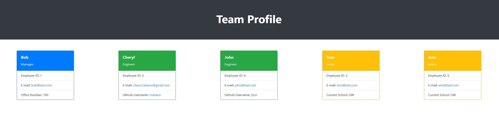

# team-profile-generator 📄 - 
HTML generator that displays team members, their roles on the team and their contact information.

## **Description**
The `Team Profile Generator` allows the user to generate a standard HTML page that displays all team member information. The user is able to add one manager and as many engineers and interns on any given team. All employee names, roles, ids and emails are included. Manager data will also include office number. Engineers wil also include GitHub usernames and interns will also include their current school.

## **Table of Contents**

- [Installation](#installation)
- [Usage](#usage)
- [License](#license)
- [Technology](#technology)
- [Questions](#questions)

## **Installation**

To install this application, make a `clone` of this repository to your local machine. Open the repository in your code editor of choice 🖥️ 

## **Usage**

Once the repository is cloned to your local machine, then:

- Install npm inquirer version 8.2.4 by running `npm install inquirer@8.2.4` in your applicable terminal
- Install jest by running `npm install --save-dev jest` in your applicable terminal if you would like to run tests on the classes
- Run `node index.js` in your applicable terminal
- Follow the prompts in the terminal to enter the team manager information first, followed by entering information for all other members (engineers and interns).
- `HTML Page Successfully Created!` will appear in your terminal once all team members have been entered and your file has been created
- Open `index.html` to see the generated HTML file

Team Profile Generator Tests:

Team Profile Generator User Prompts Walkthrough:

Team Profile Generator HTML Product with Working Links and Responsive Layout:

Sample HTML File:

[Sample Generated HTML File](./assets/sample-index.html)

## **License**

MIT License

Copyright &copy; 2022 Cheryl Caitano

Permission is hereby granted, free of charge, to any person obtaining a copy
of this software and associated documentation files (the "Software"), to deal
in the Software without restriction, including without limitation the rights
to use, copy, modify, merge, publish, distribute, sublicense, and/or sell
copies of the Software, and to permit persons to whom the Software is
furnished to do so, subject to the following conditions:

The above copyright notice and this permission notice shall be included in all
copies or substantial portions of the Software.

THE SOFTWARE IS PROVIDED "AS IS", WITHOUT WARRANTY OF ANY KIND, EXPRESS OR
IMPLIED, INCLUDING BUT NOT LIMITED TO THE WARRANTIES OF MERCHANTABILITY,
FITNESS FOR A PARTICULAR PURPOSE AND NONINFRINGEMENT. IN NO EVENT SHALL THE
AUTHORS OR COPYRIGHT HOLDERS BE LIABLE FOR ANY CLAIM, DAMAGES OR OTHER
LIABILITY, WHETHER IN AN ACTION OF CONTRACT, TORT OR OTHERWISE, ARISING FROM,
OUT OF OR IN CONNECTION WITH THE SOFTWARE OR THE USE OR OTHER DEALINGS IN THE
SOFTWARE.

## **Technology**

- [JavaScript](https://www.javascript.com/) Scripting Language
- [Node](https://nodejs.org/en/) JavaScript runtime
- [npm](https://www.npmjs.com/) Inquirer.js
- [Jest](https://jestjs.io/) JEST Testing Framework
- [Bootstrap](https://getbootstrap.com/) CSS Framework

## **Questions**

For any questions or contributions please contact me on Github or by e-mail:

[Github Profile](https://www.github.com/ccaitano)  
[Email Me](mailto:cheryl.caitano@gmail.com)